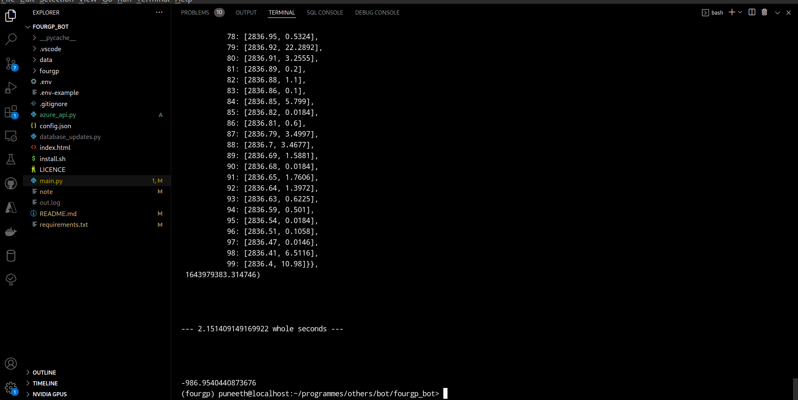
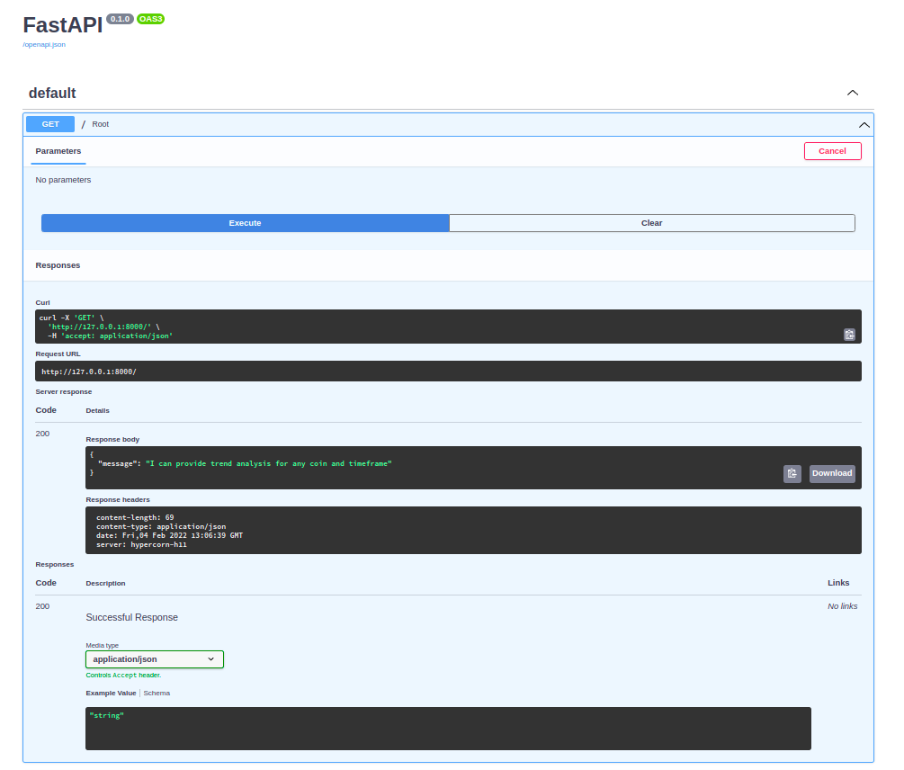
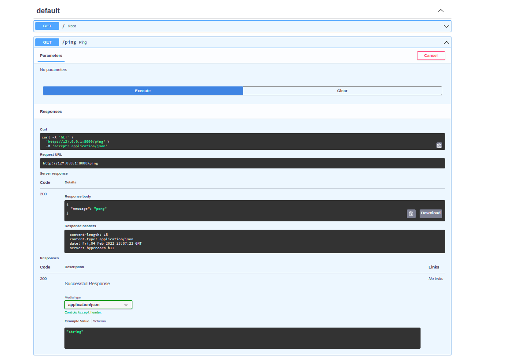
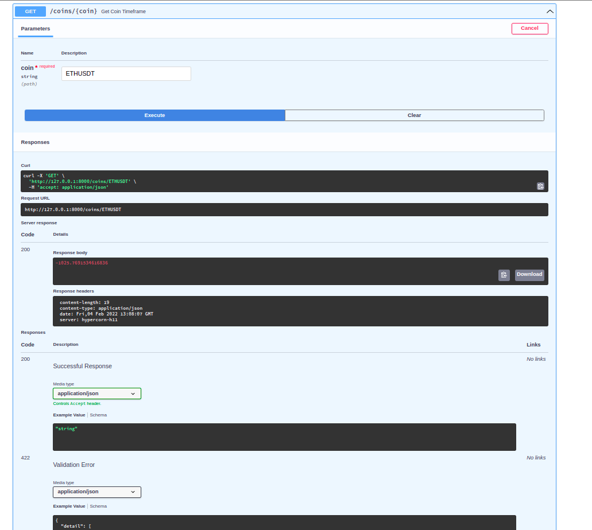
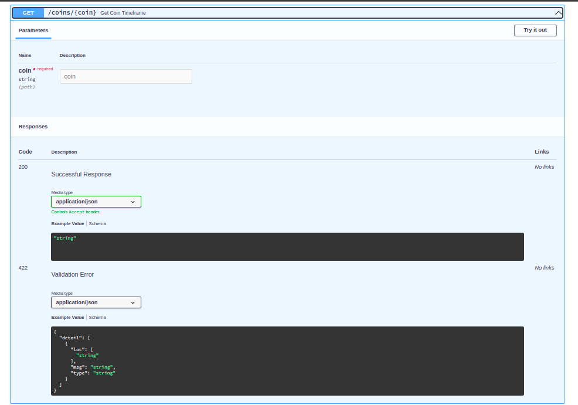
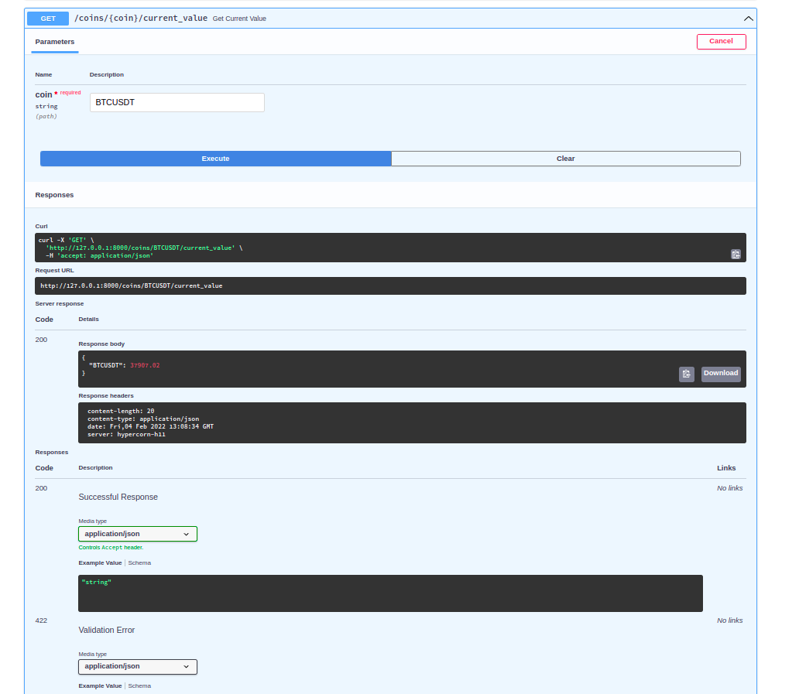

# Fourgp Bot

A complex market making bot. Which works with both candles and ticks to create signals for cryptocurrency trading.
But in this project we are able to send signals through api.(Signal's supported are, cryptocurrency prices,Klines,indicators,trend of that coin etc.,)

Api docs : [Visual api requests](http://127.0.0.1:8000/docs/)
      and  [Api usage documentation](http://127.0.0.1:8000/redoc/)

# Azure/Microsoft Azure tools used:

- [vscode](https://code.visualstudio.com/)
  * Is a main development environment for this project.Included the vscode configuration files in this project.
- [azure-cli](https://docs.microsoft.com/en-us/cli/azure/install-azure-cli?view=azure-cli-latest)
  * Is a command line interface for Azure.Which is used to access the Azure resources, and virtual machines.
- [azure-cli-tools](https://marketplace.visualstudio.com/items?itemName=ms-vscode.azurecli)
  * it is used for the deployment of the bot.
- azure linux virtual machine.
  * This is the virtual machine which is used to run the bot.

## Installation

* clone the repository [fourgp-bot](https://github.com/puneeth714/fourgp_bot.git)
* The required dependencies are listed in the [requirements.txt](requirements.txt) file.
* install the dependencies by running `bash install.sh`.
* **pip** install is recommended for windows users as install script is for unix or linux users only.
* But there are some ***conflicts*** with pip.

## Usage

* To run normally without api, uncomment the last line of the ***main.py*** file.
* change the configurations in `config.json` as per your requirements.
* run the main.py file with `python3 main.py`
* The output will be printed on the console.
* Output consists of the following:
  1. trend, indicators, zigzag, and other signals.
  

##### signals for all specified timeframe's in the config file

    1. Indicators values
     2. kline's
     3. Trend
     4. ZigZag values.

# Api Documentation

***Note:***
      - The given examples works when the api port is opened at 127.0.0.1:8000
      - You should use your specific port if its not default.
      - The api is not secured.(http requests are used)

- To start the api server run ``hypercorn azure_api.py:app --reload``
- Available indicators are:

  - rsi
  - macd
  - aroon
  - macd
- Available timeframe's are:

  - "1m","3m","5m","4h","1d".
- Example api call:

  * Get ping pong request:

    ```
    curl -X 'GET'  http://127.0.0.1:8000/ping'
    ```

    output:
    {"message":"pong"}
  * Current price of a coin

    ``curl -X 'GET'  http://127.0.0.1:8000/coins/BTCUSDT/current_value``
  * Get Current trend:
    ``curl -X 'GET' 'http://127.0.0.1:8000/coins/BTCUSDT' -H 'accept: application/json'``

    output:
    floating value. 500.0
  * Get current indicators:
    ``curl -X 'GET'  'http://127.0.0.1:8000/coins/ETHUSDT/timeframe/5m/indicators/aroon'  -H 'accept: application/json'``

    output:
    {"aroon_5m_1": [["50.0",
    " 42.85714285714286",
    " -7.142857142857143"]]}
  * To get available indicators
    ``curl -X 'GET'  'http://127.0.0.1:8000/indicators/'  -H 'accept: application/json' ``
    output:
    ``{"ema": [9,25,50,100],"rsi": [6,14],"atr": [14],"macd": [1],"aroon": [1]}``

    ***check this images for reference***
    
    
    
    
    

  ***TO try out the api check this endpoint in the browser:  [docs](http://127.0.0.1:8000/docs/)***

## To get api documentation

    check[api docs](http://127.0.0.1:8000/redoc/)
All this works when the api server is running in your local machine.

# Bot Functionality

trend    --

## Dependence on technical :

    1. RSI
                  * RSI price slope
            2. Ema short and long - is ema more(down trend) or less(up trend) and ema present is less than before(down trend) or more than  before(up trend)
            3. Macd - histogram
            4. Aroon -upper and lower
            5. Resistance and support levels

## Mathematical dependence :

##### 1. RSI --  min(RSI)=20,max(RSI)=80                                                        = x -> Directly proportional to the trend

    Should only check in higher timeframe(Relatively) : more than 15 min always.(I.e informative)
                  * Check Slope of present value of RSI and previous local min or max
                  * Check present value of price and previous local min or max.
                  * if slop difference (rsi_slope-price_slope) is negative:
                        * Then the trend reversal may happen                                          = x1 -> Inversely proportional to the trend
                    else:
                        * The trend is not changing                                                   = x2 -> Directly proportional to the trend

##### 2.    * present value - Ema_short                                                         = a -> Directly proportional to the trend

    * present value - Ema_long                                                          = b -> Directly proportional to the trend
                  * EMA_short_Previous - EMA_short_Current                                            = c -> Directly proportional to the trend
                  * EMA_long_Previous - EMA_long_Current                                              = d -> Directly proportional to the trend

##### 3. Macd - histogram                                                                       = y/asset price #FIXME -> Directly proportional to the trend

##### 4. Aroon -upper and lower -- aroon_up                                                     = min(0),max(100) = z1 -> Directly proportional to the trend

    aroon_down = min(0),max(100)                                 = 1/z2 -> Inversely proportional to the trend

##### 5. Resistance and support levels                                                          =  (resistance    - present value) -- max(resistance-support)                                                                     -> Directly proportional to the trend = 1/k1

    1/(present value - support)           -- min(0) -> Inversely proportional to the trend = k2

## Functions :

### RSI :

    * parameters -> self,RSI(present)
            * function -> Check if RSI is in local min or max
            * return -> RSI(present)

### RSI_Price_Slope: More weight

    * parameters -> self,RSI(informative_all),close_prices(informative_all)
            * function ->* call get_slope(RSI)
                        * call get_slope(close_prices)
                        slope_difference = slope_RSI - slope_close_prices
                        if slope_difference is negative:
                              * return 1/slope_difference
                        elsif slope_difference is positive:
                              * return slope_difference
                        else:
                              * return 0

### Ema_short :

    * parameters -> self,ema_short(present),value(present)
            * function->------------------------------------------Need to add functionality to check n previous values and get the average of them.(difference).
                        * difference = present value - ema_short
                        return difference

### Ema_long :

    * parameters -> self,ema_long(present),value(present)-----last n values
            * function->------------------------------------------Need to add functionality to check n previous values and get the average of them.(difference).
                        * difference = present value - ema_long
                        return difference

### EMA_short_Previous :

    * parameters -> self,ema_short_Previous(present),ema_short_current(present)---last n values
            * function->------------------------------------------Need to add functionality to check n previous values and get the average of them.(difference).
                        * difference = ema_short_current - ema_short_Previous
                        return difference

### EMA_long_Previous :

    * parameters -> self,ema_long_Previous(present),ema_long_current(present)---last n values
            * function->------------------------------------------Need to add functionality to check n previous values and get the average of them.(difference).
                        * difference = ema_long_current - ema_long_Previous
                        return difference

### Macd :

    * parameters -> self, macd_histogram(present)
            * function ->
                        * return macd_histogram(divide it by present price in trend)

### Aroon_up :

    * parameters -> self,aroon_up(present)
            * function ->
                        * return aroon_up

### Aroon_down :

    * parameters -> self,aroon_down(present)
            * function ->
                        * return 1/aroon_down

### Resistance and support :

    * parameters -> self,resistance(all),support(all),High(all),present_value(present)
            * function ->
                        * near_to_s =resistance    - present value
                        * near_to_r =1/(present value - support)
                        * touched_r = touch(resistance,price(all),up)
                        * touched_s = touch(support,price(all),down)
                        * difference = near_to_s - near_to_r
                        if difference is negative:
                              * difference= 1/(present_time-touched_r time)
                        elif difference is positive:
                              * difference= present_time-touched_s time
                        else:
                              * difference= 1
                        return near_to_r*difference*touched_r

### Touch :

    * parameters -> self,touching,prices,side
            * function ->
                  if side is up:
                        * for each_price in prices:(should iterate from present val to past)
                              if prices>touching:
                                    * return index(prices)
                        # if not touched the resistance level
                        return 1
                  elif side is down:
                        * for each_price in prices:(should iterate from present val to past)
                              if prices<touching:
                                    * return index(prices)
    # if not touched the support level
                        return 1

### Make_trend :

    * all parameters to make = Pending
Indicators Update process:
      * Get table name for that indicator
      * Check if data is present in database or not
      if true:
            * Check if data is new or not
                  * if not new
                        * Get Klines for specified timeframe and limit
                        * Calculate the indicators
                        * Write to database ---- constraint : Write to database only the new data(need a function to do so)
                  * else
                        * use that data
      else:
            * Should have klines data(as Klines is first entrance to program no problem with this test case(if klines not present))
            in database
            * Get all klines data from database/exchange
            * use it to calculate indicators
            * Write the indicators to database
            * clip the calculated data by the specified limit
      * Write to Logging table about the data collected from exchange or database.
